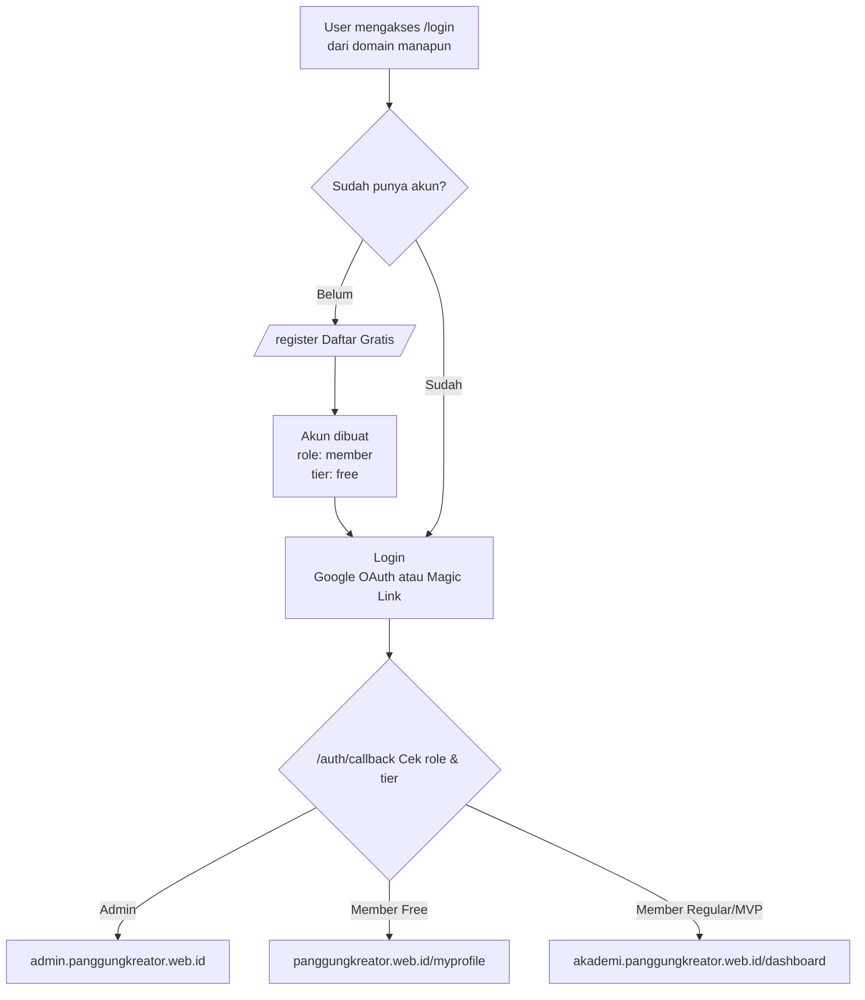
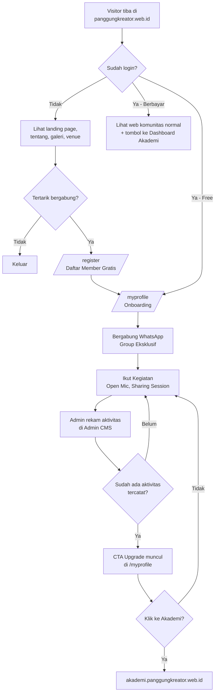
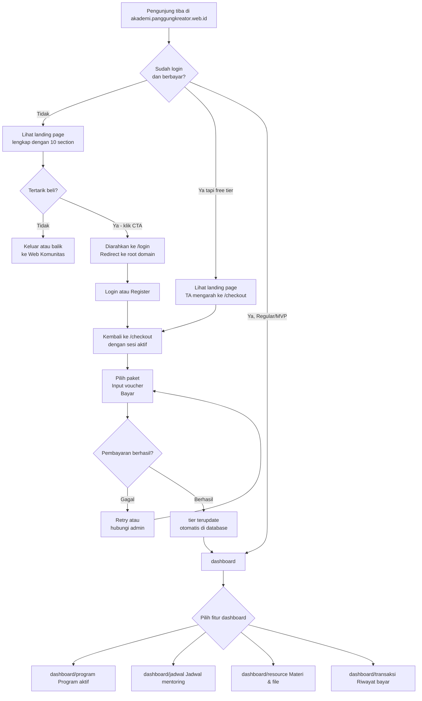
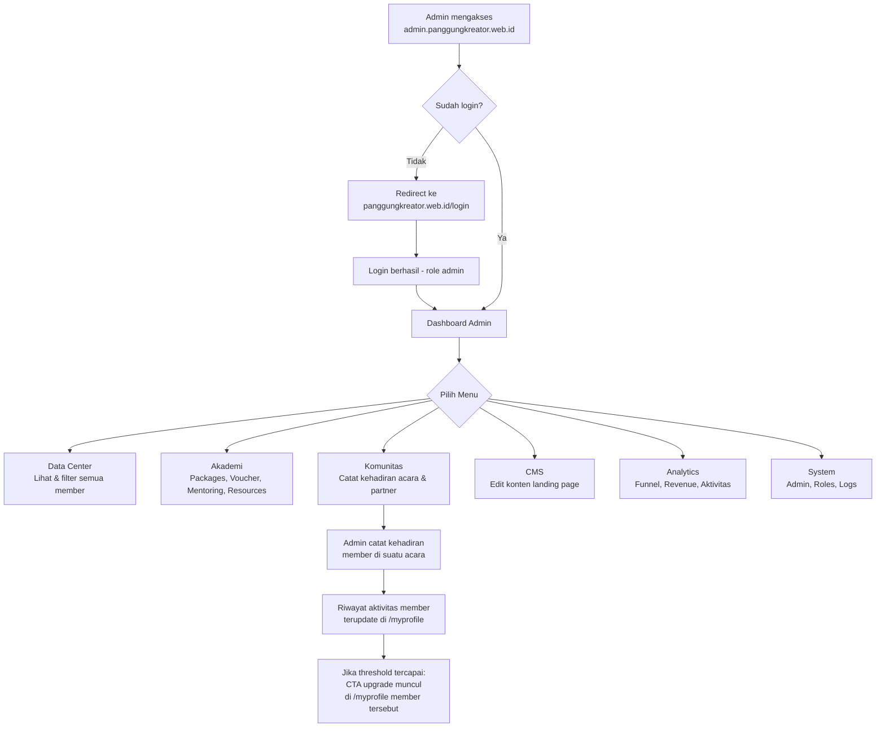
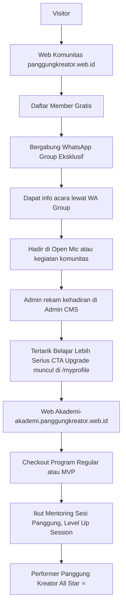
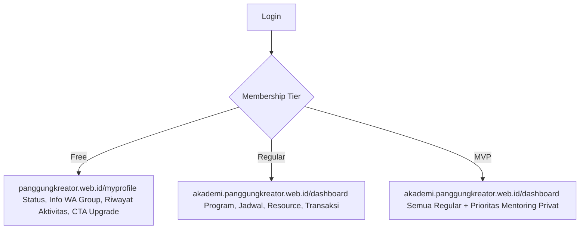
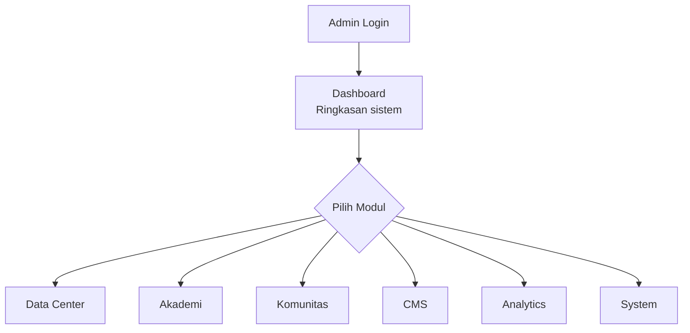
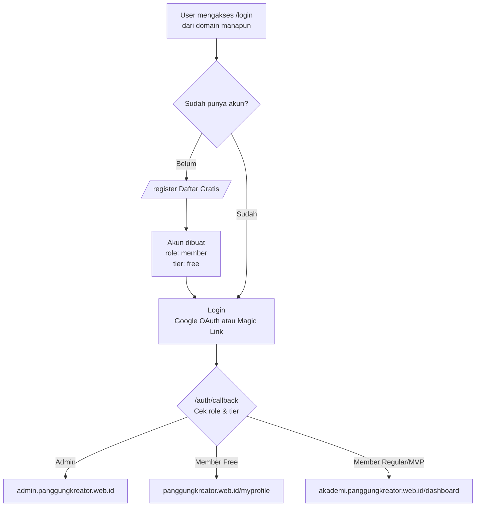

# New Concept

---

# 📐 Bagian 1: Arsitektur Sistem

## Domain - Alamat URL

| Komponen | Domain | Fungsi Utama | Audiens |
| --- | --- | --- | --- |
| **Web Komunitas** | `panggungkreator.web.id` | Community Funnel · Web Marketing · Brand Awareness | Calon member · Kafe/venue · Sponsor · Partner kampus & media |
| **Web Akademi** | `akademi.panggungkreator.web.id` | Conversion, Membership, Learning Hub | Member yang siap belajar serius |
| **Admin CMS** | `admin.panggungkreator.web.id` | Operasional Internal Terpusat | Tim inti — founder, mentor, admin operasional |

## Pembeda Web Komunitas dan Web Akademi

| Aspek | Web Komunitas | Web Akademi |
| --- | --- | --- |
| **Menjual** | Komunitas + Peluang Kolaborasi | Transformasi |
| **Tone** | Hangat, bercerita, inklusif, professional untuk mitra | Persuasif, hasil nyata, tegas |
| **Yang Ditampilkan** | Siapa kami, cerita, program, data audiens, peluang partnership | Bagaimana kami membantu, solusi belajar |
| **Program yang Disorot** | Open Mic, Sharing Session, Networking | Mentoring, Sesi Panggung, Level Up Session |
| **CTA Utama** | Gabung Member Komunitas Gratis | Mulai Perjalanan Belajarmu |
| **CTA Utama (Partner)**t | Ajukan Kolaborasi / Unduh Media Ki | - |
| **Konversi Target** | Visitor → Member Gratis ata Mitra → Partnership | Member Komunitas → Member Berbayar |

---

## Authentication

**Login hanya ada di SATU tempat:** `panggungkreator.web.id/login`

| Jika User Mengakses | Yang Terjadi |
| --- | --- |
| `akademi.panggungkreator.web.id/login` | Redirect otomatis → `panggungkreator.web.id/login` |
| `admin.panggungkreator.web.id/login` | Redirect otomatis → `panggungkreator.web.id/login` |
| `panggungkreator.web.id/login` | Langsung tampil form login |

## Flowchart Login & Redirect



## Catatan Teknis Authentication

- **Cookie session** di-set dengan `domain: '.panggungkreator.web.id'` → sesi berlaku di ketiga subdomain sekaligus tanpa login ulang
- **Member berbayar** di Web Komunitas tetap bisa klik "Buka Dashboard Akademi" di `/myprofile` tanpa login ulang
- **Member gratis** yang mencoba buka `akademi.../dashboard` langsung via URL → diarahkan ke halaman checkout, bukan ke login

---

# Web Komunitas — `panggungkreator.web.id`

### Tujuan & Peran

Wajah publik Panggung Kreator — company profile sekaligus gerbang pertama bagi siapa saja yang baru mengenal komunitas.

## Sitemap

| # | Halaman | URL | Akses | Keterangan |
| --- | --- | --- | --- | --- |
| 1 | **Landing Page** | `/` | Publik | Semua section utama ada di sini — Fi bagian Landing Page |
| 2 | **Tentang** | `/tentang` | Publik | Sejarah, visi-misi, nilai, tim — company profile mendalam |
| 3 | **Galeri** | `/galeri` | Publik | Halaman tersendiri: koleksi foto kegiatan lengkap |
| 4 | **Venue Directory** | `/venue` | Publik | Direktori venue aktif + info jadi partner venue |
| 5 | Kolaborasi | `/kolaborasi`  | Publik | Untuk kafe, sponsor, kampus, media — lihat 3.7 |
| 6 | Media Kit | `/media-kit` | Publik | Data audiens + profil komunitas — lihat 3.8 |
| 7 | **Login** | `/login` | Publik | Satu-satunya login center seluruh sistem |
| 8 | **Register** | `/register` | Publik | Daftar member gratis |
| 9 | **My Profile** | `/myprofile` | 🔒 Login | Area member — lihat detail 3.4 |

> **Halaman yang TIDAK ada (dan kenapa):**
> 
> - ~~`/event`~~ → info acara via WhatsApp Group
> - ~~`/program`~~ → cukup jadi section di landing page
> - ~~`/partner`~~ → cukup jadi section di landing page
> - ~~`/kontak`~~ → cukup jadi section/footer di landing page

## Struktur Landing Page `/`

**Goal:** Menjadikan visitor sebagai Member Komunitas (gratis)

| No | Section | Isi | Tujuan |
| --- | --- | --- | --- |
| 1 | **Hero** | Headline, sub-headline, CTA daftar gratis | Tangkap perhatian dalam 3 detik |
| 2 | **Problem** | Masalah umum: takut bicara, tidak pede, tidak punya circle | Bangun relevansi — "ini gue banget" |
| 3 | **Cerita Komunitas** | Dari 6 orang → 300+ anggota | Trust & kedekatan |
| 4 | **3 Pilar Utama** | Public Speaking · Content Creation · Personal Branding | Positioning komunitas |
| 5 | **Program Komunitas** | Open Mic, Sharing Session, Networking Session | "Ini yang kamu dapat secara gratis" |
| 6 | **Perjalanan Member** | 1 Stage 1 Progress — sistem berjalan | Bukti konkret |
| 7 | **Testimoni** | Kutipan & foto dari anggota aktif | Social proof |
| 8 | **Galeri Preview** | Grid foto kegiatan (link ke `/galeri`) | Visual aktivitas yang hidup |
| 9 | **Partner & Venue** | Logo & nama partner, preview direktori (link ke `/venue`) | Kredibilitas |
| 10 | **CTA & Kontak** | Tombol daftar gratis + info WA, IG, email | Konversi & kontak |

**CTA Utama:** `Gabung Member Komunitas — Gratis`

### Section Benefit Bergabung (masuk ke Section 5 atau 10)

Ini perlu ditonjolkan karena WhatsApp Group adalah benefit konkret pertama:

| Benefit | Keterangan |
| --- | --- |
| ✅ Akses WhatsApp Group Eksklusif | Info acara, update komunitas, koneksi antar member |
| ✅ Bisa Hadir di Open Mic | Tampil atau menonton langsung |
| ✅ Ikut Sharing Session & Networking | Kegiatan terbuka untuk member |
| ✅ Direkam Perjalanannya | Progress kamu tercatat — 1 Stage 1 Progress |

## Halaman `/myprofile` — Area Member

Setelah daftar dan login, ini "rumah" member. Sederhana, tidak perlu banyak fitur — cukup yang relevan untuk menjaga member tetap aktif dan akhirnya upgrade.

| Bagian | Isi | Fungsi |
| --- | --- | --- |
| **Status Keanggotaan** | Badge "Member Komunitas", tanggal bergabung, foto dari Google | Validasi — "saya resmi terdaftar" |
| **Info WhatsApp Group** | Status: sudah/belum bergabung ke grup WA + link/instruksi bergabung → Jika yang bener bener baru, bisa diarahkan ke whatsapp group (BTB) | Onboarding pertama setelah daftar |
| **Riwayat Aktivitas** | Daftar kegiatan yang pernah dihadiri (dicatat admin via CMS) | Rekam jejak — basis funnel upgrade |
| **Edit Profil** | Update nama, nomor WA, Instagram | Kontak valid untuk follow-up tim |
| **CTA Upgrade** | Banner "Siap belajar lebih serius?" → link ke Akademi | Tampil **setelah** ada minimal 1 aktivitas tercatat |
| **Tombol ke Akademi** | Khusus yang sudah Regular/MVP: "Buka Dashboard Akademi →" | Akses lintas domain tanpa login ulang |

> **Yang TIDAK ada di /myprofile:**
> 
> - ~~RSVP Event~~ → info acara via WhatsApp Group, bukan lewat web

## Halaman `/tentang`

Halaman tersendiri karena kontennya dalam dan sering dibuka oleh sponsor/partner yang ingin mengenal komunitas lebih jauh.

| Section | Isi |
| --- | --- |
| **Awal Mula** | Cerita lengkap berdirinya Panggung Kreator |
| **Visi & Misi** | Pernyataan visi-misi resmi |
| **Nilai-Nilai** | Nilai yang dipegang komunitas |
| **Struktur Tim** | Foto & nama founder + tim inti |
| **Timeline** | Milestone perjalanan komunitas dari awal hingga sekarang |

## 



---

# Web Akademi - `akademi.panggungkreator.web.id`

## Tujuan & Peran

Conversion engine dan learning hub. Dua bagian besar:

- **Landing page (publik):** Meyakinkan member komunitas untuk membeli program
- **Dashboard (terkunci):** Ruang belajar member yang sudah membayar

**Program tersedia saat ini:** Regular · MVP · Private Mentoring (1-on-1)
**Program masa depan:** Online Course · LMS *(perlu keputusan founder — lihat 4.4)*

## Sitemap

| # | Halaman | URL | Akses | Keterangan |
| --- | --- | --- | --- | --- |
| 1 | **Landing Akademi** | `/` | Publik | Semua section penjualan ada di sini — lihat 4.3 |
| 2 | **Login (redirect)** | `/login` | Publik | Langsung redirect → `panggungkreator.web.id/login` |
| 3 | **Checkout** | `/checkout` | 🔒 Login | Pilih paket → voucher → bayar |
| 4 | **Dashboard** | `/dashboard` | 🔒 Regular/MVP | Home dashboard member berbayar |
| 5 | **Program Saya** | `/dashboard/program` | 🔒 Regular/MVP | Program yang sedang diikuti |
| 6 | **Jadwal Mentoring** | `/dashboard/jadwal` | 🔒 Regular/MVP | Kalender sesi 1-on-1 |
| 7 | **Resource** | `/dashboard/resource` | 🔒 Regular/MVP | Materi, file, referensi |
| 8 | **Transaksi** | `/dashboard/transaksi` | 🔒 Regular/MVP | Riwayat pembayaran |
| 9 | **Online Course** | `/dashboard/course` | 🔜 Future | Menunggu keputusan founder |

> **Halaman yang TIDAK ada (dan kenapa):**
> 
> - ~~`/program`~~ → cukup jadi section di landing page
> - ~~`/program/[slug]`~~ → pricing & deskripsi sudah cukup di section landing page
> - ~~`/testimoni`~~ → cukup jadi section di landing page
> - ~~`/faq`~~ → cukup jadi section di landing page

## Struktur Landing Page `/`

**Goal:** Mendorong Member Komunitas membeli program Akademi

| No | Section | Isi | Tujuan |
| --- | --- | --- | --- |
| 1 | **Hero Offer** | Headline program, sub-headline transformasi, CTA | Value proposition utama |
| 2 | **Pain Point** | Gugup, minder, blank saat harus bicara | "Ini kamu?" — bangun relevansi |
| 3 | **Kenapa Ini Terjadi** | Belum punya sistem belajar yang terstruktur | Reframing masalah |
| 4 | **Solusi Akademi** | Program belajar terstruktur yang menjawab pain point | Perkenalkan solusi |
| 5 | **Metode Belajar** | Sesi Panggung, Level Up Session, Private Mentoring | Jelaskan cara kerjanya |
| 6 | **Roadmap Perkembangan** | Beginner → Intermediate → Performer | Visualisasikan perjalanan |
| 7 | **Program & Harga** | Tabel perbandingan Regular vs MVP vs Private | Titik keputusan utama |
| 8 | **Testimoni Alumni** | Kutipan + hasil nyata dari alumni | Bukti, bukan janji |
| 9 | **FAQ** | 5-8 pertanyaan umum yang muncul sebelum checkout | Hilangkan keraguan terakhir |
| 10 | **CTA Checkout** | Tombol final + urgensi | Konversi |

**CTA Utama:** `Mulai Perjalanan Belajarmu`

## ⚠️ Status Online Course

> **Perlu didiskusikan dengan founder sebelum dikerjakan:**
> 
> - Apakah online course menjadi benefit membership atau dijual terpisah?
> - Kapan target mulai dibangun?
> 
> **Untuk saat ini:** Dashboard hanya menampilkan jadwal sesi mentoring 1-on-1 dan resource materi. Struktur database untuk course sudah disiapkan pondasinya, tapi halaman belum dibangun sampai keputusan ada.
> 

## Flowchart Web Akademi



---

# Web Admin - `admin.panggungkreator.web.id`

## Tujuan & Peran

Dashboard operasional terpusat → murni alat kerja internal. Tidak ada konten publik. Semua halaman butuh login dengan role admin.

## Struktur Menu Lengkap

| Menu Utama | Sub Menu | Keterangan |
| --- | --- | --- |
| **📊 Dashboard** | Ringkasan Sistem | Snapshot: jumlah member, transaksi terbaru, aktivitas tercatat |
| **👥 Data Center** | Member | Daftar semua member (gratis + berbayar) dalam satu tabel |
|  | Attendance | Rekap aktivitas member yang dicatat admin |
| **🎓 Akademi** | Packages | CRUD paket Regular, MVP, Private |
|  | Voucher | CRUD kode diskon |
|  | Registration | Verifikasi pendaftaran & pembayaran Rp49k |
|  | Mentoring | Jadwal sesi mentoring aktif |
|  | Resources | Upload & kelola materi |
| **🎤 Komunitas** | Acara - Event | Buat & kelola acara (untuk pencatatan kehadiran) |
|  | Venue | Database venue + AI rekomendasi |
|  | Partner | Daftar kafe, kampus, brand, media partner |
| **✏️ CMS** | Landing Komunitas | Inline edit konten `panggungkreator.web.id` |
|  | Landing Akademi | Inline edit konten `akademi.panggungkreator.web.id` |
|  | Media Library | Upload & manajemen aset gambar |
| **📈 Analytics** | Funnel | Tracking visitor → free → berbayar |
|  | Revenue | Laporan pendapatan |
|  | Aktivitas | Rekap kehadiran & engagement member |
| **⚙️ System** | Admin Users | Daftar & undang akun admin |
|  | Roles & Permissions | Pengaturan hak akses per role |
|  | Activity Logs | Log aktivitas admin di sistem |

> **Catatan:** Menu "Open Mic & Acara" di Komunitas bukan untuk publish info acara ke website — tapi untuk **mencatat siapa saja yang hadir** di setiap kegiatan. Info acaranya tetap lewat WhatsApp Group.
> 

## Hak Akses Per Role

| Modul | Super Admin | Admin Akademi | Admin Komunitas |
| --- | --- | --- | --- |
| **Dashboard** | ✅ | ✅ | ✅ |
| **Member** | ✅ Full | 👁 View | 👁 View |
| **Attendance** | ✅ | ❌ | ✅ |
| **Packages** | ✅ | ✅ | ❌ |
| **Voucher** | ✅ | ✅ | ❌ |
| **Registration** | ✅ | ✅ | ❌ |
| **Mentoring** | ✅ | ✅ | ❌ |
| **Resources** | ✅ | ✅ | ❌ |
| **Open Mic & Acara** | ✅ | ❌ | ✅ |
| **Venue & Partner** | ✅ | ❌ | ✅ |
| **CMS** | ✅ Full | 📝 Akademi only | 📝 Komunitas only |
| **Analytics** | ✅ | 👁 Akademi only | 👁 Komunitas only |
| **System** | ✅ | ❌ | ❌ |

> **Keterangan:** ✅ Full · 👁 View Only · 📝 Edit terbatas · ❌ Tidak bisa akses
> 

## Flowchart Admin CMS



---

# User Journey Lengkap

## Dari Visitor sampai Performer



## User Journey Per Tier



## User Journey Admin



---

# Masalah Teknis: Struktur Folder Project

## Konsep Routing

```
panggungkreator.web.id         →  app/ (root — tanpa prefix)
akademi.panggungkreator.web.id →  app/akademi/ (via rewrite middleware)
admin.panggungkreator.web.id   →  app/admin-app/ (via rewrite middleware)
```

## Struktur Lengkap

```
front/
│
├── middleware.ts                           ← Otak pembagi domain
│
├── app/
│   │
│   │  ── SHARED AUTH (berlaku di 3 domain) ──────────────────
│   ├── login/
│   │   └── page.tsx                        ← Satu-satunya login center
│   ├── register/
│   │   └── page.tsx                        ← Daftar member gratis
│   └── auth/
│       └── callback/
│           └── route.ts                    ← Redirect by role & tier
│   │
│   │  ── WEB KOMUNITAS (panggungkreator.web.id) ─────────────
│   ├── page.tsx                            ← Landing page (10 section)
│   ├── tentang/
│   │   └── page.tsx                        ← Sejarah, visi-misi, tim
│   ├── galeri/
│   │   └── page.tsx                        ← Koleksi foto kegiatan
│   └── myprofile/
│       └── page.tsx                        ← Area member (semua tier)
│   │
│   │  ── WEB AKADEMI (akademi.panggungkreator.web.id) ───────
│   ├── akademi/
│   │   ├── page.tsx                        ← Landing page (10 section)
│   │   ├── checkout/
│   │   │   └── page.tsx
│   │   └── dashboard/
│   │       ├── layout.tsx                  ← GUARD: blokir jika tier = free
│   │       ├── page.tsx                    ← Home dashboard
│   │       ├── program/
│   │       │   └── page.tsx
│   │       ├── jadwal/
│   │       │   └── page.tsx
│   │       ├── resource/
│   │       │   └── page.tsx
│   │       ├── transaksi/
│   │       │   └── page.tsx
│   │       └── course/
│   │           └── page.tsx                ← [FUTURE — tunggu keputusan founder]
│   │
│   │  ── ADMIN CMS (admin.panggungkreator.web.id) ───────────
│   ├── admin-app/
│   │   ├── layout.tsx                      ← GUARD: blokir jika role = member
│   │   ├── page.tsx                        ← Dashboard ringkasan
│   │   ├── data-center/
│   │   │   ├── members/
│   │   │   │   └── page.tsx
│   │   │   └── attendance/
│   │   │       └── page.tsx
│   │   ├── akademi/
│   │   │   ├── packages/
│   │   │   │   ├── page.tsx
│   │   │   │   ├── create/page.tsx
│   │   │   │   └── [id]/page.tsx
│   │   │   ├── voucher/
│   │   │   │   └── page.tsx
│   │   │   ├── registration/
│   │   │   │   └── page.tsx
│   │   │   ├── mentoring/
│   │   │   │   └── page.tsx
│   │   │   └── resources/
│   │   │       └── page.tsx
│   │   ├── komunitas/
│   │   │   ├── acara/
│   │   │   │   ├── page.tsx                ← Daftar & buat acara (untuk absensi)
│   │   │   │   ├── create/page.tsx
│   │   │   │   └── [id]/page.tsx           ← Detail acara + rekam kehadiran
│   │   │   ├── venue/
│   │   │   │   └── page.tsx
│   │   │   └── partner/
│   │   │       └── page.tsx
│   │   ├── cms/
│   │   │   ├── komunitas/
│   │   │   │   └── page.tsx
│   │   │   ├── akademi/
│   │   │   │   └── page.tsx
│   │   │   └── media/
│   │   │       └── page.tsx
│   │   ├── analytics/
│   │   │   ├── funnel/page.tsx
│   │   │   ├── revenue/page.tsx
│   │   │   └── aktivitas/page.tsx
│   │   └── system/
│   │       ├── admins/page.tsx
│   │       ├── roles/page.tsx
│   │       └── logs/page.tsx
│   │
│   └── api/
│       └── upload/
│           └── route.ts
│
├── components/
│   ├── ui/                                 ← Button, Input, Table, Badge (shared)
│   ├── editor/
│   │   ├── Edit.tsx                        ← Headless inline edit
│   │   └── EditorContext.tsx
│   ├── komunitas/                          ← Komponen khusus Web Komunitas
│   ├── akademi/                            ← Komponen khusus Web Akademi
│   └── admin/
│       └── Sidebar.tsx                     ← Render menu berdasarkan role
│
└── lib/
    ├── supabase/
    │   ├── client.ts
    │   ├── server.ts                       ← Cookie: domain '.panggungkreator.web.id'
    │   └── middleware.ts
    ├── auth/
    │   ├── getRedirectTarget.ts
    │   └── rbac.ts
    └── animations/
        └── useScrollAnimation.ts           ← GSAP/Lenis untuk landing page
```

---

# Key Code

## Code: `middleware.ts`

```tsx
import { NextResponse } from 'next/server'
import type { NextRequest } from 'next/server'

const ROOT_DOMAIN = 'panggungkreator.web.id'
const AUTH_PATHS = ['/login', '/register', '/auth']

export function middleware(req: NextRequest) {
  const hostname = req.headers.get('host') || ''
  const { pathname, search } = req.nextUrl
  const sub = hostname.replace(`.${ROOT_DOMAIN}`, '').replace(ROOT_DOMAIN, '')

  // Subdomain non-root yang mencoba akses /login atau /register
  // → redirect ke root domain (login center terpusat)
  if (AUTH_PATHS.some(p => pathname.startsWith(p)) && sub !== '' && sub !== 'www') {
    return NextResponse.redirect(
      new URL(`https://${ROOT_DOMAIN}${pathname}${search}`)
    )
  }

  if (sub === 'akademi') {
    return NextResponse.rewrite(new URL(`/akademi${pathname}${search}`, req.url))
  }
  if (sub === 'admin') {
    return NextResponse.rewrite(new URL(`/admin-app${pathname}${search}`, req.url))
  }

  return NextResponse.next()
}

export const config = {
  matcher: ['/((?!_next/static|_next/image|favicon.ico).*)'],
}
```

## Code: `auth/callback` — Redirect by Role & Tier

```tsx
const { data: member } = await supabase
  .from('members')
  .select('role, membership_tier')
  .eq('id', user.id)
  .single()

// Admin → Admin CMS
if (member.role !== 'member') {
  return NextResponse.redirect('https://admin.panggungkreator.web.id')
}

// Member Gratis → My Profile di Web Komunitas
if (member.membership_tier === 'free') {
  return NextResponse.redirect('https://panggungkreator.web.id/myprofile')
}

// Member Berbayar → Dashboard Akademi
const redirectParam = searchParams.get('redirect')
const target = redirectParam ?? 'https://akademi.panggungkreator.web.id/dashboard'
return NextResponse.redirect(target)
```

## Cookie Session Lintas Domain

```tsx
// lib/supabase/server.ts
cookieOptions: {
  domain: '.panggungkreator.web.id', // titik di depan = semua subdomain
  sameSite: 'lax',
  secure: true,
  path: '/',
}
```

---

# Master URL Reference

| URL | Folder di Kode | Akses |
| --- | --- | --- |
| `panggungkreator.web.id/` | `app/page.tsx` | Publik |
| `panggungkreator.web.id/tentang` | `app/tentang/` | Publik |
| `panggungkreator.web.id/galeri` | `app/galeri/` | Publik |
| `panggungkreator.web.id/venue` | `app/venue/` | Publik |
| `panggungkreator.web.id/login` | `app/login/` | Publik — **LOGIN CENTER** |
| `panggungkreator.web.id/register` | `app/register/` | Publik |
| `panggungkreator.web.id/myprofile` | `app/myprofile/` | 🔒 Login (semua tier) |
| `akademi.panggungkreator.web.id/` | `app/akademi/page.tsx` | Publik |
| `akademi.panggungkreator.web.id/login` | — | **Redirect → root `/login`** |
| `akademi.panggungkreator.web.id/checkout` | `app/akademi/checkout/` | 🔒 Login |
| `akademi.panggungkreator.web.id/dashboard` | `app/akademi/dashboard/` | 🔒 Regular/MVP |
| `akademi.panggungkreator.web.id/dashboard/program` | `app/akademi/dashboard/program/` | 🔒 Regular/MVP |
| `akademi.panggungkreator.web.id/dashboard/jadwal` | `app/akademi/dashboard/jadwal/` | 🔒 Regular/MVP |
| `akademi.panggungkreator.web.id/dashboard/resource` | `app/akademi/dashboard/resource/` | 🔒 Regular/MVP |
| `akademi.panggungkreator.web.id/dashboard/transaksi` | `app/akademi/dashboard/transaksi/` | 🔒 Regular/MVP |
| `admin.panggungkreator.web.id/login` | — | **Redirect → root `/login`** |
| `admin.panggungkreator.web.id/` | `app/admin-app/page.tsx` | 🔒 Semua admin |
| `admin.panggungkreator.web.id/data-center/*` | `app/admin-app/data-center/` | 🔒 Semua admin |
| `admin.panggungkreator.web.id/akademi/*` | `app/admin-app/akademi/` | 🔒 Super Admin, Admin Akademi |
| `admin.panggungkreator.web.id/komunitas/*` | `app/admin-app/komunitas/` | 🔒 Super Admin, Admin Komunitas |
| `admin.panggungkreator.web.id/cms/*` | `app/admin-app/cms/` | 🔒 Super Admin (Full), lainnya (Limited) |
| `admin.panggungkreator.web.id/analytics/*` | `app/admin-app/analytics/` | 🔒 Sesuai scope role |
| `admin.panggungkreator.web.id/system/*` | `app/admin-app/system/` | 🔒 **Super Admin ONLY** |

---

# Open Items — Perlu Keputusan

| # | Topik | Pertanyaan | Urgency |
| --- | --- | --- | --- |
| 1 | **Online Course** | Benefit membership atau dijual terpisah? Siapa buat konten? Kapan target? | 🔴 Harus jelas sebelum bangun dashboard |
| 2 | **Private Mentoring** | Tetap sub-paket di Akademi atau dipisah jadi produk sendiri? | 🟡 Sebelum bangun halaman program |
| 3 | **WhatsApp Group** | Siapa yang mengelola undangan ke grup WA? Manual oleh admin atau otomatis setelah daftar? | 🟡 Sebelum launch Web Komunitas |
| 4 | **Analytics** | Cukup data internal Supabase atau perlu integrasi tools eksternal (Mixpanel, Posthog)? | 🟢 Bisa diputuskan belakangan |
| 5 | **Venue Directory** | Data venue di `/venue` tampil semua atau perlu approval admin dulu sebelum publik? | 🟡 Sebelum bangun halaman venue |

---

# 🚀 Bagian 11: Urutan Pengerjaan

| Tahap | Yang Dikerjakan | Status |
| --- | --- | --- |
| **0** | Finalisasi open items (Bagian 10) bersama founder | ⬜ |
| **1** | `middleware.ts` + folder placeholder semua domain | ⬜ |
| **2** | Cookie domain Supabase + tes sesi lintas subdomain | ⬜ |
| **3** | `app/login/`, `app/register/`, `app/auth/callback/` | ⬜ |
| **4** | Migrasi modul admin existing ke `app/admin-app/akademi/` | ⬜ |
| **5** | `app/myprofile/` — area member (tanpa RSVP, dengan riwayat aktivitas) | ⬜ |
| **6** | Halaman publik Web Komunitas: `/`, `/tentang`, `/galeri`, `/venue` | ⬜ |
| **7** | Landing Page Akademi `app/akademi/page.tsx` | ⬜ |
| **8** | Modul baru Admin CMS: acara/absensi, venue, partner, analytics | ⬜ |
| **9** | Dashboard Akademi + checkout + payment gateway | ⬜ |
| **10** | Online Course & LMS | 🔜 Tunggu keputusan |

---



Macam macam member:

| **No** | **WA Group** | **Deskripsi** | **Fungsi** |
| --- | --- | --- | --- |
| 1. | Komunitas Panggung Kreator @Bandung (General) | Member lama dan baru | Tujuan itu untuk memberikan informasi seputar Sesi Panggung (Workshop), Level up Challenge dan Open Mic. |
| 2. | PanggungKreatorPriority | Member lama yang aktif
Ketentuan:  mereka yang sudah ikut dua kelas (Panggung 9  dan 10) termasuk → orang-orang  hadir  minimal 3 kali di Open Mic Teman Sepanggung | Mereka ini disiapkan untuk menjadi seorang Performer, mentor, dan Public Speaker. |
| 3. | PanggungKreatorMembership | Member baru yang bayar Rp. 49.000 | Karena mereka ada sesi khusus mentoring yang merupakan benefit dari membership |
| 4. | KomunitasBeraniTampilBicara | Member baru (sebagai pendukung, side community) | Side Community (Funnel marketing) → Ngadain Workshop yang full Praktek. → Scale up untuk Join Membership Panggung Kreator. |

Orang baru (Tau dari Konten Medsos Pangkre - Dari Teman rekomendasi)  → Landingpage (akademi.panggungkreator.web.id) → Bayar Rp. 49.000 (di web akademi.panggungkreator.web.id) → Masuk grup PanggungKreatorMembership (dengan beberapa benefit lainnya) & Grup Panggung Kreator at Bandung.

Orang baru yang tau dari Threads, IG, Dari Teman (Noted: Pengen Nyobain atau Gratisan dulu) → Daftar Gratis → Otomatis masuk ke Grup BeraniTampilBIcara → Agendanya adalah Workshop (Free) / Funnel Marketing → Scale Up: Jika ingin masuk ke grup yang lebih intensif masuk → Bayar Rp. 49.000 (di web akademi.panggungkreator.web.id) → Masuk grup PanggungKreatorMembership (dengan beberapa benefit lainnya) & Grup Panggung Kreator at Bandung.

Orang daftar di BTB tetap melalui WEB → Landingpage (nama. Email, WA) → Diarahkan untuk Grup BTB.

Treatment antara Peserta Offline dan Online


Kenapa kok ada sistem daftar, fungsinya sebagai database member, yang nantinya bisa dipake pada saat upgrade 49ribu dan juga onlinecourse. 

Nantinya juga temen temen yang ada di grup komunitaspanggungkreator dan panggungkreatorpriority bisa daftar agar datanya tercatat.

Website Utama Community : [panggungkreator.web.id](http://panggungkreator.web.id) → **Brand Awareness**

Website Marketing / LandingPage: [pangg](http://panggungkreator.web.id)ungkreator.web.id/lp