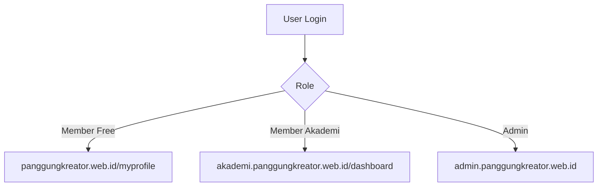
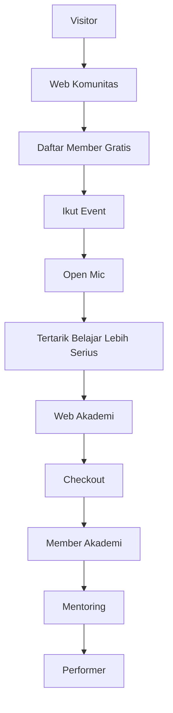
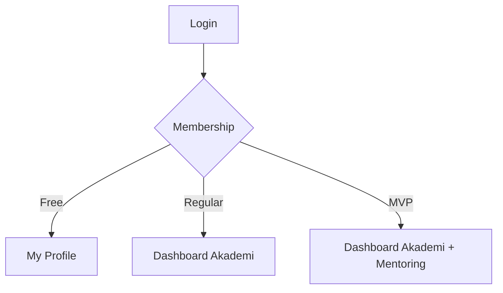
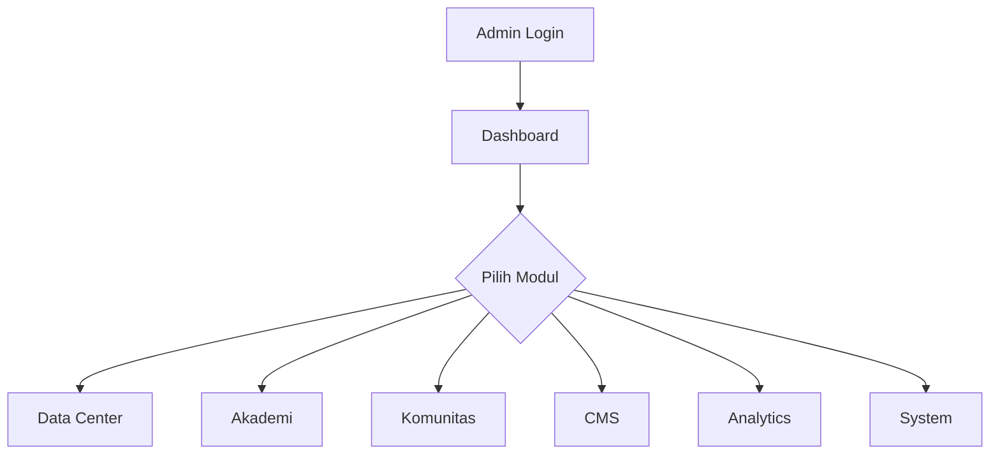

# PROJECT-PANGKREAS-1.md

# Struktur Final Domain, Sitemap, Landing Page & User Flow

## Sistem Terpadu Panggung Kreator

Versi: 1.1

---

# 1. Arsitektur Sistem

## Konsep

| Komponen      | Domain                           | Fungsi                           |
| ------------- | -------------------------------- | -------------------------------- |
| Web Komunitas | `panggungkreator.web.id`         | Awareness, Branding, Community   |
| Web Akademi   | `akademi.panggungkreator.web.id` | Conversion, Membership, Learning |
| Admin CMS     | `admin.panggungkreator.web.id`   | Operasional Internal             |

---

## Prinsip Sistem

* 1 Database
* 1 Authentication
* 1 Member Identity
* 1 Login Center
* Multi Frontend

---

# 2. Login Terpusat

## Login Center

| URL                            |
| ------------------------------ |
| `panggungkreator.web.id/login` |

---

## Redirect Rule

| Akses                                | Redirect                     |
| ------------------------------------ | ---------------------------- |
| akademi.panggungkreator.web.id/login | panggungkreator.web.id/login |
| admin.panggungkreator.web.id/login   | panggungkreator.web.id/login |

---

## Flow Login



---

# 3. Domain 1

# panggungkreator.web.id

## Tujuan

### Awareness

Mengenalkan:

* Panggung Kreator
* Program Komunitas
* Event
* Open Mic
* Partnership

---

### Community Funnel

Mengubah:

```text
Visitor
↓
Member Komunitas
↓
Peserta Event
↓
Member Akademi
```

---

## Sitemap

| Halaman           | URL           | Tipe    |
| ----------------- | ------------- | ------- |
| Home              | /             | Public  |
| Tentang           | /tentang      | Public  |
| Program Komunitas | /program      | Public  |
| Event             | /event        | Public  |
| Detail Event      | /event/[slug] | Public  |
| Galeri            | /galeri       | Public  |
| Partner           | /partner      | Public  |
| Venue Directory   | /venue        | Public  |
| Kontak            | /kontak       | Public  |
| Login             | /login        | Public  |
| Register          | /register     | Public  |
| My Profile        | /myprofile    | Private |

---

# Struktur Landing Page

# panggungkreator.web.id

## Goal Utama

```text
Menjadikan visitor sebagai Member Komunitas
```

---

## Section Landing Page

| No | Section                     | Tujuan                                               |
| -- | --------------------------- | ---------------------------------------------------- |
| 1  | Hero Section                | Menjelaskan apa itu Panggung Kreator                 |
| 2  | Problem Section             | Masalah umum: takut bicara, kurang percaya diri      |
| 3  | Cerita Panggung Kreator     | Dari 6 orang menjadi 300+ anggota                    |
| 4  | 3 Pilar Utama               | Public Speaking, Content Creation, Personal Branding |
| 5  | Program Komunitas           | Open Mic, Sharing Session, Networking                |
| 6  | Perjalanan Member           | 1 Stage 1 Progress                                   |
| 7  | Testimoni Member            | Social Proof                                         |
| 8  | Galeri Kegiatan             | Aktivitas komunitas                                  |
| 9  | Partner & Venue             | Kredibilitas                                         |
| 10 | CTA Gabung Member Komunitas | Konversi                                             |

---

## CTA Utama

```text
Gabung Member Komunitas Gratis
```

---

# 4. Domain 2

# akademi.panggungkreator.web.id

## Tujuan

### Conversion Engine

Mengubah:

```text
Member Komunitas
↓
Member Akademi
```

---

### Learning Hub

Saat ini:

* Regular
* MVP
* Private Mentoring

Future:

* Online Course
* LMS

---

## Sitemap

| Halaman          | URL                  | Tipe    |
| ---------------- | -------------------- | ------- |
| Landing Akademi  | /                    | Public  |
| Program          | /program             | Public  |
| Detail Program   | /program/[slug]      | Public  |
| Testimoni        | /testimoni           | Public  |
| FAQ              | /faq                 | Public  |
| Checkout         | /checkout            | Private |
| Dashboard        | /dashboard           | Member  |
| Program Saya     | /dashboard/program   | Member  |
| Jadwal Mentoring | /dashboard/jadwal    | Member  |
| Resource         | /dashboard/resource  | Member  |
| Transaksi        | /dashboard/transaksi | Member  |
| Online Course    | /dashboard/course    | Future  |

---

# Struktur Landing Page

# akademi.panggungkreator.web.id

## Goal Utama

```text
Membeli Program Akademi
```

---

## Section Landing Page

| No | Section              | Tujuan                                      |
| -- | -------------------- | ------------------------------------------- |
| 1  | Hero Offer           | Public Speaking & Personal Branding Program |
| 2  | Pain Point           | Gugup, Minder, Blank Saat Bicara            |
| 3  | Kenapa Ini Terjadi   | Belum punya sistem belajar                  |
| 4  | Solusi Akademi       | Program belajar terstruktur                 |
| 5  | Metode Belajar       | Sesi Panggung, Level Up Session, Mentoring  |
| 6  | Roadmap Perkembangan | Beginner → Performer                        |
| 7  | Program & Harga      | Regular, MVP, Private                       |
| 8  | Testimoni Alumni     | Bukti hasil                                 |
| 9  | FAQ                  | Menjawab keraguan                           |
| 10 | CTA Checkout         | Konversi                                    |

---

## CTA Utama

```text
Mulai Perjalanan Belajarmu
```

---

# Perbedaan Landing Page

| Komunitas        | Akademi                 |
| ---------------- | ----------------------- |
| Siapa Kami       | Bagaimana Kami Membantu |
| Cerita Komunitas | Solusi Belajar          |
| Program Gratis   | Program Berbayar        |
| Open Mic         | Mentoring               |
| Networking       | Transformasi Skill      |
| Join Community   | Checkout Program        |

---

# 5. Domain 3

# admin.panggungkreator.web.id

## Tujuan

Dashboard Operasional Terpusat

---

## Struktur Menu

| Menu Utama  | Sub Menu                                          |
| ----------- | ------------------------------------------------- |
| Dashboard   | Ringkasan Sistem                                  |
| Data Center | Members, Transactions, Attendance                 |
| Akademi     | Packages, Voucher, Payment, Mentoring, Resources  |
| Komunitas   | Event, Open Mic, Venue, Partner                   |
| CMS         | Landing Komunitas, Landing Akademi, Media Library |
| Analytics   | Funnel, Revenue, Event Performance                |
| System      | Admin User, Roles, Permissions, Logs              |

---

## Hak Akses

| Modul        | Super Admin | Admin Akademi | Admin Komunitas |
| ------------ | ----------- | ------------- | --------------- |
| Members      | ✅           | View          | View            |
| Transactions | ✅           | ✅             | ❌               |
| Packages     | ✅           | ✅             | ❌               |
| Voucher      | ✅           | ✅             | ❌               |
| Events       | ✅           | ❌             | ✅               |
| Venue        | ✅           | ❌             | ✅               |
| CMS          | ✅           | Limited       | Limited         |
| Settings     | ✅           | ❌             | ❌               |

---

# 6. User Journey

## Visitor menjadi Member Akademi



---

## User Journey Member



---

## User Journey Admin



---

# 7. Insight Penting

## Web Komunitas

Menjual:

```text
Komunitas
```

Bukan Membership.

---

## Web Akademi

Menjual:

```text
Transformasi
```

Bukan sekadar kelas.

---

## Admin CMS

Mengelola:

```text
Seluruh Operasional Panggung Kreator
```

Dengan prinsip:

```text
Satu Rumah
Dua Pintu
Satu Dapur
```
