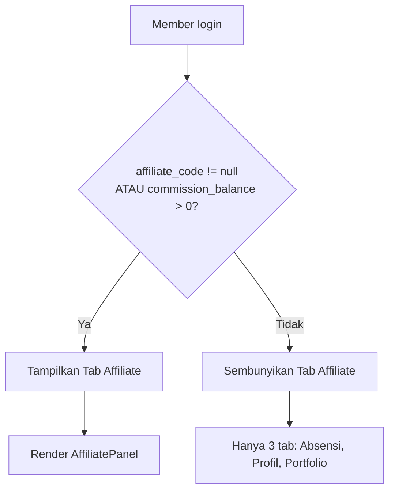

# Implementation Plan: Halaman Profil Member Baru

> Berdasarkan [design.md](file:///d:/Community/Pangkreas/Project/panggung-kreator/docs/web-komunitas/my-profile/design.md)
> Target: Rewrite halaman `/myprofile` dengan layout responsive sidebar + tabs, tambah fitur **Absensi Tracker**, conditional affiliate visibility, dan admin routing redirect.

---

## Keputusan Desain

| Keputusan | Pilihan |
|---|---|
| Heatmap Absensi | ❌ **Tidak di v1** — cukup statistik + tabel riwayat |
| Layout | **Responsive** — Sidebar kiri di desktop, collapse ke horizontal card di mobile |
| Tab Absensi | Statistik ringkas (total hadir, rate, streak) + tabel riwayat kehadiran |
| Afiliasi/Komisi | **Conditional** — Sembunyikan jika `affiliate_code` null DAN `commission_balance` = 0 |
| Admin Redirect | Non-admin akses `/admin/*` → redirect ke `/myprofile` (bukan `/dashboard`) |
| Dependencies Baru | **Tidak ada** — semua paket sudah terinstall |
| Migrasi Database | **Tidak diperlukan** — semua tabel & kolom sudah exist di production |

---

## Fase 1: Foundation (Types, Layout, Sidebar)

### 1.1 [MODIFY] `lib/types/member.ts`

Tambahkan interface baru untuk Attendance:

```typescript
// === TAMBAHKAN di akhir file ===

export interface AttendanceEvent {
  title: string
  event_type: string
  event_date: string
  start_time: string
  end_time: string | null
  location: string
}

export interface AttendanceRecord {
  id: string
  event_id: string
  member_id: string
  is_present: boolean
  scan_method: 'qr' | 'manual' | 'rsvp_only' | null
  scanned_at: string | null
  created_at: string
  event: AttendanceEvent
}

export interface AttendanceStats {
  totalAttended: number
  totalEvents: number
  attendanceRate: number       // percentage 0-100
  currentStreak: number
  longestStreak: number
  lastAttendedEvent: AttendanceEvent | null
}

export interface ReferralMember {
  id: string
  full_name: string
  email: string | null
  membership_tier: MembershipTier
  created_at: string
}
```

---

### 1.2 [NEW] `app/(community)/myprofile/components/ProfileLayout.tsx`

Layout wrapper dengan sidebar + main area.

```
Desktop (lg+):
┌──────────────────┬────────────────────────────────────────┐
│    SIDEBAR        │   STATS CARDS                          │
│    (fixed-width)  │   ────────────────────────────────────  │
│                   │   [ Tab1 | Tab2 | Tab3 | Tab4 ]        │
│                   │   ────────────────────────────────────  │
│                   │   [        Tab Content        ]        │
└──────────────────┴────────────────────────────────────────┘

Mobile:
┌──────────────────────────────────────────────────┐
│   SIDEBAR (horizontal card, collapsible)          │
├──────────────────────────────────────────────────┤
│   STATS CARDS (2 cols grid)                       │
├──────────────────────────────────────────────────┤
│   [ Tab1 | Tab2 | Tab3 | Tab4 ]                  │
├──────────────────────────────────────────────────┤
│   [          Tab Content              ]           │
└──────────────────────────────────────────────────┘
```

**Props:**

```typescript
interface ProfileLayoutProps {
  sidebar: React.ReactNode
  statsCards: React.ReactNode
  tabs: React.ReactNode
  children: React.ReactNode  // tab content
}
```

**Implementasi:**

```tsx
export default function ProfileLayout({ sidebar, statsCards, tabs, children }: ProfileLayoutProps) {
  return (
    <div className="min-h-screen w-full bg-[#FAF9F6] dark:bg-[#0A0A0A] text-black dark:text-white font-sans py-8 px-4 sm:px-6 lg:px-8">
      <div className="max-w-6xl w-full mx-auto">
        {/* Desktop: 2-column, Mobile: stacked */}
        <div className="flex flex-col lg:flex-row gap-8">
          
          {/* Sidebar — fixed width on desktop */}
          <aside className="w-full lg:w-[280px] lg:min-w-[280px] flex-shrink-0">
            {sidebar}
          </aside>

          {/* Main content area */}
          <main className="flex-1 min-w-0 space-y-6">
            {statsCards}
            {tabs}
            <div className="animate-fade-in">
              {children}
            </div>
          </main>

        </div>
      </div>
    </div>
  )
}
```

**Design System Compliance:**
- Background: `#FAF9F6` (light) / `#0A0A0A` (dark) — sesuai existing `myprofile`
- Border: `border-[#2c2c2c]` (light) / `border-white` (dark) — sesuai design-system.md
- Sharp corners: `rounded-none` — **tidak ada** border-radius
- Typography: Sans-serif bold + Serif italic accents

---

### 1.3 [NEW] `app/(community)/myprofile/components/ProfileSidebar.tsx`

Sidebar identitas member.

**Props:**

```typescript
interface ProfileSidebarProps {
  member: MemberProfile
  onSignout: () => void
}
```

**Struktur Visual:**

```
┌──────────────────────────┐
│   ┌──────────────────┐   │
│   │    AVATAR (80×80) │   │  → members.avatar_url (fallback: inisial)
│   └──────────────────┘   │
│   Stage Name              │  → members.stage_name (font-serif italic)
│   Full Name               │  → members.full_name (font-black uppercase)
│   @username               │  → members.username
│                           │
│   ┌──────────────────┐   │
│   │ 🏷️ PRIORITY      │   │  → TierBadge dari members.membership_tier
│   └──────────────────┘   │
│   📍 Jakarta              │  → members.city
│   💼 Content Creator      │  → members.occupation
│   ─────────────────────   │
│   📱 Instagram  ↗         │  → link ke instagram
│   📱 TikTok    ↗         │  → link ke tiktok
│   📺 YouTube   ↗         │  → link ke youtube
│   💼 LinkedIn  ↗         │  → link ke linkedin
│   🔗 Website   ↗         │  → link ke portfolio_url
│   ─────────────────────   │
│   📧 member@email.com     │  → members.email
│   📞 0812xxx              │  → members.whatsapp_number
│   ─────────────────────   │
│   🗓 Bergabung:            │  → members.created_at (formatted)
│   12 Januari 2026         │
│                           │
│   [ 🚪 Keluar ]           │  → signout button
└──────────────────────────┘
```

**Mobile Collapsed View:**

```
┌──────────────────────────────────────────────────────────┐
│  [Avatar] Stage Name  @username   🏷 PRIORITY  [Keluar]  │
│           Jakarta · Content Creator                       │
└──────────────────────────────────────────────────────────┘
```

**Kolom DB yang dipakai:**

| Kolom | Tabel | Fungsi |
|---|---|---|
| `avatar_url` | members | Foto profil |
| `stage_name` | members | Nama panggung (Serif italic) |
| `full_name` | members | Nama lengkap (Sans uppercase) |
| `username` | members | Handle @username |
| `membership_tier` | members | Badge tier |
| `community` | members | Komunitas (PK / BTB) |
| `city` | members | Lokasi |
| `occupation` | members | Pekerjaan |
| `instagram_username` | members | Link Instagram |
| `tiktok_username` | members | Link TikTok |
| `youtube_url` | members | Link YouTube |
| `linkedin_url` | members | Link LinkedIn |
| `portfolio_url` | members | Link website |
| `email` | members | Email kontak |
| `whatsapp_number` | members | No WA |
| `created_at` | members | Tanggal bergabung |

---

### 1.4 [NEW] `app/(community)/myprofile/components/ProfileStatsCards.tsx`

4 kartu statistik ringkasan horizontal.

**Props:**

```typescript
interface ProfileStatsCardsProps {
  membershipTier: MembershipTier
  totalAttended: number
  commissionBalance: number
  totalReferrals: number
}
```

**Struktur Visual:**

```
┌─────────────┬─────────────┬─────────────┬─────────────┐
│ 🏷 TIER      │ 📅 KEHADIRAN │ 💰 KOMISI    │ 👥 REFERRAL  │
│ PRIORITY     │ 12 Event    │ Rp 150.000  │ 5 Orang     │
└─────────────┴─────────────┴─────────────┴─────────────┘
Mobile: 2×2 grid
```

**Detail per kartu:**

| # | Label | Value | Sumber Data | Ikon | Visibility |
|---|---|---|---|---|---|
| 1 | `MEMBERSHIP TIER` | `PRIORITY` / `FREE` / `MEMBERSHIP` | `members.membership_tier` | `Award` | ✅ Selalu tampil |
| 2 | `TOTAL KEHADIRAN` | `12 Event` | `COUNT(attendances WHERE is_present=true)` | `CalendarCheck` | ✅ Selalu tampil |
| 3 | `SALDO KOMISI` | `Rp 150.000` | `members.commission_balance` | `DollarSign` | ⚠️ **Conditional** |
| 4 | `TEMAN DIAJAK` | `5 Orang` | `COUNT(members WHERE referred_by=:id)` | `Users` | ⚠️ **Conditional** |

> [!IMPORTANT]
> **Kartu #3 dan #4 hanya ditampilkan jika member sudah terdaftar affiliate.**
> Kondisi tampil: `member.affiliate_code !== null` ATAU `member.commission_balance > 0`.
> Jika tidak memenuhi, stats cards hanya menampilkan 2 kartu (Tier + Kehadiran) dalam layout `grid-cols-2`.

**Props (Updated):**

```typescript
interface ProfileStatsCardsProps {
  membershipTier: MembershipTier
  totalAttended: number
  commissionBalance: number
  totalReferrals: number
  isAffiliateActive: boolean  // NEW — kontrol visibility kartu komisi & referral
}
```

**Logika conditional:**

```typescript
// Helper: apakah member terdaftar affiliate?
const isAffiliateActive = (member: MemberProfile): boolean => {
  return !!member.affiliate_code || member.commission_balance > 0
}
```

**Styling (Editorial Monochrome):**

```tsx
// Grid responsive: 2 kartu jika non-affiliate, 4 kartu jika affiliate
<div className={`grid gap-4 ${
  isAffiliateActive 
    ? 'grid-cols-2 md:grid-cols-4' 
    : 'grid-cols-1 md:grid-cols-2'
}`}>
  {/* Kartu 1: Tier — selalu tampil */}
  <StatsCard icon={Award} label="MEMBERSHIP TIER" value={membershipTier.toUpperCase()} />
  
  {/* Kartu 2: Kehadiran — selalu tampil */}
  <StatsCard icon={CalendarCheck} label="TOTAL KEHADIRAN" value={`${totalAttended} Event`} />
  
  {/* Kartu 3: Komisi — hanya jika affiliate aktif */}
  {isAffiliateActive && (
    <StatsCard icon={DollarSign} label="SALDO KOMISI" value={`Rp ${commissionBalance.toLocaleString('id-ID')}`} />
  )}
  
  {/* Kartu 4: Referral — hanya jika affiliate aktif */}
  {isAffiliateActive && (
    <StatsCard icon={Users} label="TEMAN DIAJAK" value={`${totalReferrals} Orang`} />
  )}
</div>
```

```tsx
// Sub-komponen StatsCard:
function StatsCard({ icon: Icon, label, value }: { icon: any, label: string, value: string }) {
  return (
    <div className="border border-[#2c2c2c] dark:border-white/20 p-4 flex items-center space-x-4">
      <div className="bg-neutral-100 dark:bg-neutral-900 p-3">
        <Icon size={24} />
      </div>
      <div>
        <span className="text-[9px] font-mono text-[#666666] uppercase block tracking-[0.25em]">
          [ {label} ]
        </span>
        <span className="text-sm font-black uppercase tracking-wider">
          {value}
        </span>
      </div>
    </div>
  )
}
```

---

## Fase 2: Tab Navigation & Absensi Tracker

### 2.1 [NEW] `app/(community)/myprofile/components/ProfileTabs.tsx`

Tab navigation component.

**Props:**

```typescript
type ProfileTab = 'attendance' | 'profile' | 'portfolio' | 'affiliate'

interface ProfileTabsProps {
  activeTab: ProfileTab
  onTabChange: (tab: ProfileTab) => void
}
```

**Struktur Visual:**

```
┌─────────────┬───────────┬──────────────┬────────────────┐
│  [ Absensi ] │ [ Profil ] │ [ Portfolio ] │ [ Affiliate ]  │
└─────────────┴───────────┴──────────────┴────────────────┘
Active: border-t-2 border-t-black, font-bold, bg-white
Inactive: border-transparent, text-[#666666]
```

**Styling (Editorial — sesuai existing myprofile):**

```tsx
<div className="flex border-b border-[#2c2c2c]/10 dark:border-white/10 gap-2 overflow-x-auto">
  {tabs.map(tab => (
    <button
      key={tab.key}
      onClick={() => onTabChange(tab.key)}
      className={`px-6 py-3 text-xs font-mono uppercase tracking-widest 
        border border-b-0 rounded-none cursor-pointer transition-all whitespace-nowrap
        ${activeTab === tab.key
          ? 'bg-white dark:bg-[#121212] border-[#2c2c2c]/20 dark:border-white/20 text-black dark:text-white font-bold border-t-2 border-t-black dark:border-t-white'
          : 'border-transparent text-[#666666] hover:text-black dark:hover:text-white'
        }`}
    >
      {tab.label}
    </button>
  ))}
</div>
```

**Props (Updated):**

```typescript
type ProfileTab = 'attendance' | 'profile' | 'portfolio' | 'affiliate'

interface ProfileTabsProps {
  activeTab: ProfileTab
  onTabChange: (tab: ProfileTab) => void
  isAffiliateActive: boolean  // NEW — kontrol visibility tab affiliate
}
```

**Tab definitions (conditional):**

```typescript
const allTabs = [
  { key: 'attendance' as const, label: '[ Absensi ]' },
  { key: 'profile' as const,    label: '[ Edit Profil ]' },
  { key: 'portfolio' as const,  label: '[ Kelola Portfolio ]' },
  { key: 'affiliate' as const,  label: '[ Program Affiliate ]' },
]

// Filter: sembunyikan tab affiliate jika member belum terdaftar
const tabs = isAffiliateActive
  ? allTabs
  : allTabs.filter(t => t.key !== 'affiliate')
```

> [!NOTE]
> Jika `isAffiliateActive = false`, tab "Program Affiliate" **tidak dirender** sama sekali.
> Member yang belum affiliate hanya melihat 3 tab: Absensi, Edit Profil, Kelola Portfolio.

---

### 2.2 [NEW] `app/(community)/myprofile/components/AttendanceTracker.tsx`

Komponen utama tab Absensi. Menggabungkan `AttendanceStats` + `AttendanceHistory`.

**Props:**

```typescript
interface AttendanceTrackerProps {
  memberId: string
}
```

**Data Fetching (lazy load saat tab aktif):**

```typescript
const fetchAttendance = async () => {
  const supabase = createClient()
  const { data, error } = await supabase
    .from('attendances')
    .select(`
      id, is_present, scan_method, scanned_at, created_at,
      event:events(title, event_type, event_date, start_time, end_time, location)
    `)
    .eq('member_id', memberId)
    .order('created_at', { ascending: false })

  return data as AttendanceRecord[]
}
```

**Struktur Visual:**

```
┌──────────────────────────────────────────────────────────┐
│  STATISTIK KEHADIRAN                                     │
│  ┌──────────┬──────────┬──────────┬──────────┐           │
│  │ 12       │ 15       │ 80%      │ 3        │           │
│  │ Hadir    │ Total    │ Rate     │ Streak   │           │
│  └──────────┴──────────┴──────────┴──────────┘           │
│                                                          │
│  ─────────────────────────────────────────────           │
│                                                          │
│  [ RIWAYAT KEHADIRAN EVENT ]                             │
│  ┌─────────────────────────────────────────────────────┐ │
│  │ Nama Event     │ Tipe    │ Tanggal     │ Status     │ │
│  │────────────────│─────────│─────────────│────────────│ │
│  │ Open Mic #12   │ open_mic│ 5 Aug 2026  │ ✅ Hadir   │ │
│  │ MC Practice #3 │ mc_prac │ 28 Jul 2026 │ ✅ Hadir   │ │
│  │ Sharing Sess.  │ sharing │ 20 Jul 2026 │ ❌ Absen   │ │
│  └─────────────────────────────────────────────────────┘ │
│                                                          │
│  Event Terakhir: Open Mic #12 — 5 Agustus 2026          │
└──────────────────────────────────────────────────────────┘
```

---

### 2.3 [NEW] `app/(community)/myprofile/components/AttendanceStats.tsx`

Kartu statistik kehadiran.

**Props:**

```typescript
interface AttendanceStatsProps {
  stats: AttendanceStats
}
```

**Kalkulasi `AttendanceStats` dari `AttendanceRecord[]`:**

```typescript
function calculateAttendanceStats(records: AttendanceRecord[]): AttendanceStats {
  const attended = records.filter(r => r.is_present)
  const totalEvents = records.length
  const totalAttended = attended.length
  const attendanceRate = totalEvents > 0 ? Math.round((totalAttended / totalEvents) * 100) : 0

  // Streak calculation: urut by event_date DESC, hitung beruntun is_present=true
  const sortedByDate = [...records].sort(
    (a, b) => new Date(b.event.event_date).getTime() - new Date(a.event.event_date).getTime()
  )
  
  let currentStreak = 0
  for (const r of sortedByDate) {
    if (r.is_present) currentStreak++
    else break
  }

  let longestStreak = 0, tempStreak = 0
  for (const r of sortedByDate) {
    if (r.is_present) { tempStreak++; longestStreak = Math.max(longestStreak, tempStreak) }
    else tempStreak = 0
  }

  const lastAttendedEvent = attended.length > 0 ? attended[0].event : null

  return { totalAttended, totalEvents, attendanceRate, currentStreak, longestStreak, lastAttendedEvent }
}
```

**Struktur Visual (4 mini-cards):**

```
┌──────────┬──────────┬──────────┬──────────┐
│  12      │  15      │  80%     │  3🔥     │
│  HADIR   │  TOTAL   │  RATE    │  STREAK  │
└──────────┴──────────┴──────────┴──────────┘
```

**Styling:**

```tsx
// Setiap mini-card:
<div className="border border-[#2c2c2c]/20 dark:border-white/10 p-4 text-center">
  <div className="text-2xl font-black text-black dark:text-white">{value}</div>
  <div className="text-[9px] font-mono text-[#666666] uppercase tracking-[0.25em] mt-1">
    [ {label} ]
  </div>
</div>
```

---

### 2.4 [NEW] `app/(community)/myprofile/components/AttendanceHistory.tsx`

Tabel riwayat kehadiran.

**Props:**

```typescript
interface AttendanceHistoryProps {
  records: AttendanceRecord[]
}
```

**Kolom Tabel:**

| Header | Sumber Data | Format |
|---|---|---|
| `NAMA EVENT` | `event.title` | Text bold |
| `TIPE` | `event.event_type` | Badge label (`Open Mic`, `MC Practice`, dll) |
| `TANGGAL` | `event.event_date` | `dd MMM yyyy` (locale id-ID) |
| `LOKASI` | `event.location` | Text |
| `STATUS` | `is_present` | ✅ `HADIR` (hijau) / ❌ `ABSEN` (merah) |
| `METODE` | `scan_method` | Badge: `QR` / `MANUAL` / `RSVP` |

**Mapping `event_type` ke label:**

```typescript
const EVENT_TYPE_LABELS: Record<string, string> = {
  'open_mic': 'Open Mic',
  'mc_practice': 'MC Practice',
  'voice_over': 'Voice Over Challenge',
  'sharing_session': 'Sharing Session',
  'networking': 'Networking Session',
  'workshop': 'Workshop',
  'content_class': 'Content Creator Class',
  'branding_class': 'Personal Branding Class',
}
```

**Styling (Editorial Table — sesuai existing myprofile referral table):**

```tsx
<div className="border border-[#2c2c2c]/20 dark:border-white/10 overflow-x-auto rounded-none">
  <table className="w-full text-left border-collapse text-xs">
    <thead>
      <tr className="bg-neutral-50 dark:bg-neutral-900 border-b border-[#2c2c2c]/20 dark:border-white/10 
                     text-[10px] font-mono uppercase text-[#666666] tracking-[0.15em]">
        <th className="p-3">Nama Event</th>
        <th className="p-3">Tipe</th>
        <th className="p-3">Tanggal</th>
        <th className="p-3">Lokasi</th>
        <th className="p-3">Status</th>
        <th className="p-3">Metode</th>
      </tr>
    </thead>
    <tbody>
      {/* ... rows */}
    </tbody>
  </table>
</div>
```

**Empty State:**

```tsx
<div className="border border-dashed border-[#2c2c2c]/30 dark:border-white/20 py-8 text-center 
               text-xs text-[#666666] font-mono">
  [ BELUM ADA RIWAYAT KEHADIRAN EVENT ]
</div>
```

---

## Fase 3: Affiliate Panel (Conditional Visibility)

### 3.1 [NEW] `app/(community)/myprofile/components/AffiliatePanel.tsx`

Dipecah dari implementasi inline di `page.tsx` (baris 174-256) menjadi komponen mandiri.

> [!IMPORTANT]
> Komponen ini **hanya dirender** jika `isAffiliateActive = true`.
> Guard dilakukan di level `page.tsx` (tidak render tab + tidak render panel).
> Komponen ini sendiri **tidak perlu** melakukan pengecekan ulang.

**Props:**

```typescript
interface AffiliatePanelProps {
  member: MemberProfile
  referrals: ReferralMember[]
}
```

**Struktur Visual (tidak berubah dari existing, hanya dipindah ke komponen sendiri):**

```
┌──────────────────────────────────────────────────────────┐
│  Program Affiliate Panggung Kreator                      │  ← font-serif italic
│  Bagikan tautan referal unik Anda...                     │  ← deskripsi
│                                                          │
│  [ LINK AFFILIATE ANDA ]                                 │
│  ┌─────────────────────────────────┬─────────┐           │
│  │ https://...?ref=ABC123          │ [ COPY ] │           │
│  └─────────────────────────────────┴─────────┘           │
│                                                          │
│  [ DAFTAR REFERRAL TEMAN YANG BERGABUNG ]                │
│  ┌─────────────────────────────────────────────────────┐ │
│  │ Nama     │ Email        │ Membership │ Tgl Gabung   │ │
│  │──────────│──────────────│────────────│──────────────│ │
│  │ Andi S.  │ andi@...     │ MEMBERSHIP │ 12 Jul 2026  │ │
│  │ Budi K.  │ budi@...     │ FREE       │ 5 Jun 2026   │ │
│  └─────────────────────────────────────────────────────┘ │
└──────────────────────────────────────────────────────────┘
```

**Visibility Flow:**



**Kolom DB yang dipakai:**

| Kolom | Tabel | Fungsi | Visibility |
|---|---|---|---|
| `affiliate_code` | members | Generate link referral | Guard condition |
| `commission_balance` | members | Saldo komisi (ada di stats cards) | Guard condition |
| `referred_by` | members | Filter teman yang diajak | — |
| `full_name` | members (referred) | Nama teman | — |
| `email` | members (referred) | Email teman | — |
| `membership_tier` | members (referred) | Tier teman | — |
| `created_at` | members (referred) | Tanggal bergabung | — |

---

## Fase 4: Page Rewrite (Orchestration)

### 4.1 [MODIFY] `app/(community)/myprofile/page.tsx`

Rewrite total dari 264 baris menjadi orchestrator yang merangkai semua komponen.

**State Management:**

```typescript
type ProfileTab = 'attendance' | 'profile' | 'portfolio' | 'affiliate'

// State
const [member, setMember] = useState<MemberProfile | null>(null)
const [referrals, setReferrals] = useState<ReferralMember[]>([])
const [attendanceCount, setAttendanceCount] = useState(0)
const [isLoading, setIsLoading] = useState(true)
const [activeTab, setActiveTab] = useState<ProfileTab>('attendance')  // default = absensi

// Derived state — conditional affiliate visibility
const affiliateActive = member 
  ? (!!member.affiliate_code || member.commission_balance > 0) 
  : false
```

**Data Fetching Strategy:**

```typescript
const fetchAllProfileData = async () => {
  const supabase = createClient()
  const { data: { user } } = await supabase.auth.getUser()
  if (!user) { router.push('/login'); return }

  // Parallel fetching — hanya data yang selalu dibutuhkan
  const [profileRes, attendanceCountRes, referralRes] = await Promise.all([
    // 1. Profile + interests
    supabase
      .from('members')
      .select('*, interests:member_interests(*)')
      .eq('id', user.id)
      .single(),
    
    // 2. Attendance count (untuk stats card)
    supabase
      .from('attendances')
      .select('id', { count: 'exact', head: true })
      .eq('member_id', user.id)
      .eq('is_present', true),
    
    // 3. Referred members (tetap fetch untuk conditional render)
    supabase
      .from('members')
      .select('id, full_name, email, membership_tier, created_at')
      .eq('referred_by', user.id)
      .order('created_at', { ascending: false }),
  ])

  setMember(profileRes.data)
  setAttendanceCount(attendanceCountRes.count ?? 0)
  setReferrals(referralRes.data ?? [])
}
```

> [!NOTE]  
> Detail attendance records di-fetch **lazy** oleh `AttendanceTracker` saat tab absensi aktif.
> Portfolio data di-fetch **lazy** oleh `PortfolioManager` (existing behavior).
> Referral data tetap di-fetch di awal agar count tersedia untuk stats card (jika affiliate aktif).

**Render Structure (Updated with conditional affiliate):**

```tsx
<ProfileLayout
  sidebar={<ProfileSidebar member={member} onSignout={handleSignout} />}
  statsCards={
    <ProfileStatsCards
      membershipTier={member.membership_tier}
      totalAttended={attendanceCount}
      commissionBalance={member.commission_balance}
      totalReferrals={referrals.length}
      isAffiliateActive={affiliateActive}  // NEW
    />
  }
  tabs={
    <ProfileTabs 
      activeTab={activeTab} 
      onTabChange={setActiveTab} 
      isAffiliateActive={affiliateActive}  // NEW
    />
  }
>
  {activeTab === 'attendance' && (
    <AttendanceTracker memberId={member.id} />
  )}
  {activeTab === 'profile' && (
    <ProfileForm member={member} onSave={fetchAllProfileData} />
  )}
  {activeTab === 'portfolio' && (
    <PortfolioManager memberId={member.id} />
  )}
  {/* Affiliate tab hanya dirender jika affiliate aktif */}
  {activeTab === 'affiliate' && affiliateActive && (
    <AffiliatePanel member={member} referrals={referrals} />
  )}
</ProfileLayout>
```

> [!IMPORTANT]
> **Double guard:** Tab affiliate di-hide di `ProfileTabs` + konten di-guard di render.
> Jika member entah bagaimana set `activeTab='affiliate'` tapi `affiliateActive=false`, konten tidak akan render.

---

## Fase 5: Admin Routing Redirect

### 5.1 [MODIFY] Semua admin `page.tsx` — Ubah redirect `/dashboard` → `/myprofile`

Saat ini, **28 halaman admin** menggunakan pattern yang sama untuk menolak non-admin:

```typescript
// SEBELUM (existing di semua admin page.tsx)
if (!member || member.role !== 'admin') {
  redirect('/dashboard');  // ← user non-admin dilempar ke /dashboard
}
```

Ubah semua menjadi:

```typescript
// SESUDAH
if (!member || member.role !== 'admin') {
  redirect('/myprofile');  // ← user non-admin diarahkan ke profil mereka
}
```

**Daftar 28 file yang perlu diubah (semua di `front/app/(admin)/admin/`):**

| # | File Path | Baris |
|---|---|---|
| 1 | `admin/page.tsx` | L26 |
| 2 | `admin/members/page.tsx` | L28 |
| 3 | `admin/acara/page.tsx` | L27 |
| 4 | `admin/acara/create/page.tsx` | L27 |
| 5 | `admin/acara/[id]/page.tsx` | L50 |
| 6 | `admin/admins/page.tsx` | L28 |
| 7 | `admin/admins/[id]/page.tsx` | L35 |
| 8 | `admin/aktivitas/page.tsx` | L27 |
| 9 | `admin/attendance/page.tsx` | L27 |
| 10 | `admin/funnel/page.tsx` | L27 |
| 11 | `admin/galeri/page.tsx` | L28 |
| 12 | `admin/galeri/addGallery/page.tsx` | L34 |
| 13 | `admin/logs/page.tsx` | L27 |
| 14 | `admin/media/page.tsx` | L27 |
| 15 | `admin/mentoring/page.tsx` | L27 |
| 16 | `admin/mentoring/addMentoring/page.tsx` | L34 |
| 17 | `admin/packages/page.tsx` | L29 |
| 18 | `admin/partner/page.tsx` | L27 |
| 19 | `admin/partner/addPartner/page.tsx` | L34 |
| 20 | `admin/payment/page.tsx` | L27 |
| 21 | `admin/registration/page.tsx` | L28 |
| 22 | `admin/resources/page.tsx` | L27 |
| 23 | `admin/resources/addResource/page.tsx` | L34 |
| 24 | `admin/revenue/page.tsx` | L27 |
| 25 | `admin/transactions/page.tsx` | L27 |
| 26 | `admin/venue/page.tsx` | L27 |
| 27 | `admin/venue/addVenue/page.tsx` | L34 |
| 28 | `admin/voucher/page.tsx` | L28 |

**Implementasi:** Search-and-replace sederhana di semua file:

```diff
- redirect("/dashboard");
+ redirect("/myprofile");
```

> [!NOTE]
> Ini adalah perubahan **text replacement** murni — tidak ada logika baru, hanya mengubah target redirect. Saat ini `/dashboard` bukan halaman yang aktif untuk member biasa, sehingga redirect ke `/myprofile` lebih tepat karena halaman profil member sudah tersedia dan memiliki konten yang relevan.

---

## Rangkuman File

### Daftar Semua File yang Dibuat/Dimodifikasi

| # | File | Aksi | Ukuran Est. | Fase |
|---|---|---|---|---|
| 1 | `front/lib/types/member.ts` | MODIFY | +40 baris | 1 |
| 2 | `front/app/(community)/myprofile/components/ProfileLayout.tsx` | NEW | ~45 baris | 1 |
| 3 | `front/app/(community)/myprofile/components/ProfileSidebar.tsx` | NEW | ~160 baris | 1 |
| 4 | `front/app/(community)/myprofile/components/ProfileStatsCards.tsx` | NEW | ~90 baris | 1 |
| 5 | `front/app/(community)/myprofile/components/ProfileTabs.tsx` | NEW | ~60 baris | 2 |
| 6 | `front/app/(community)/myprofile/components/AttendanceTracker.tsx` | NEW | ~90 baris | 2 |
| 7 | `front/app/(community)/myprofile/components/AttendanceStats.tsx` | NEW | ~80 baris | 2 |
| 8 | `front/app/(community)/myprofile/components/AttendanceHistory.tsx` | NEW | ~110 baris | 2 |
| 9 | `front/app/(community)/myprofile/components/AffiliatePanel.tsx` | NEW | ~120 baris | 3 |
| 10 | `front/app/(community)/myprofile/page.tsx` | REWRITE | ~140 baris | 4 |
| 11–38 | `front/app/(admin)/admin/**/page.tsx` (28 files) | MODIFY | 1 baris each | 5 |

**Total: 9 file baru + 30 file dimodifikasi ≈ ~950 baris kode**

### File Existing yang Di-reuse (Tidak Dimodifikasi)

| File | Komponen | Dipakai di Tab |
|---|---|---|
| `front/components/member/ProfileForm.tsx` | `<ProfileForm>` | `profile` |
| `front/components/member/PortfolioManager.tsx` | `<PortfolioManager>` | `portfolio` |
| `front/components/member/ImageUploader.tsx` | Internal `ProfileForm` | — |
| `front/components/member/VideoLinkInput.tsx` | Internal `PortfolioManager` | — |

---

## Skema Database yang Dipakai

Tidak ada migrasi, semua tabel sudah ada di production (`wmuzvefmrbgffftkpdnx`).

### Query Referensi per Komponen

| Komponen | Query |
|---|---|
| **ProfileSidebar** | `SELECT * FROM members WHERE id = :uid` (sudah di-fetch oleh page) |
| **ProfileStatsCards** | `SELECT COUNT(*) FROM attendances WHERE member_id = :uid AND is_present = true` |
| **AttendanceTracker** | `SELECT a.*, e.title, e.event_type, e.event_date, e.start_time, e.end_time, e.location FROM attendances a JOIN events e ON a.event_id = e.id WHERE a.member_id = :uid ORDER BY e.event_date DESC` |
| **AffiliatePanel** | `SELECT id, full_name, email, membership_tier, created_at FROM members WHERE referred_by = :uid` |

### RLS Policies Checklist

| Tabel | Policy | Status |
|---|---|---|
| `members` | `SELECT` own data | ✅ Sudah ada |
| `member_interests` | `SELECT` own data | ✅ Sudah ada |
| `portfolio_items` | `SELECT/INSERT/UPDATE/DELETE` own data | ✅ Sudah ada |
| `attendances` | `SELECT` own data | ⚠️ **Perlu verifikasi** |
| `events` | `SELECT` published events | ⚠️ **Perlu verifikasi** |

> [!WARNING]
> Sebelum implementasi Fase 2 (Absensi), perlu verifikasi RLS policy pada tabel `attendances` dan `events` agar member bisa `SELECT` data kehadirannya sendiri. Jika belum ada, tambahkan:
> ```sql
> -- attendances: member can read own attendance
> CREATE POLICY "Members can view own attendance"
>   ON public.attendances FOR SELECT
>   USING (member_id = auth.uid());
>
> -- events: anyone can read published events
> CREATE POLICY "Anyone can view published events"
>   ON public.events FOR SELECT
>   USING (is_published = true);
> ```

---

## Verification Plan

### Build Check

```bash
cd front && npm run build
```

### Manual Verification

**Profil & Layout:**
1. Login sebagai member → buka `/myprofile`
2. Pastikan sidebar menampilkan semua info personal
3. Klik tab **Absensi** → cek tabel riwayat kehadiran muncul
4. Klik tab **Edit Profil** → cek `ProfileForm` masih berfungsi
5. Klik tab **Kelola Portfolio** → cek `PortfolioManager` masih berfungsi
6. Test responsive di mobile viewport (< 768px) — sidebar collapse
7. Test dark mode toggle

**Conditional Affiliate (User TANPA affiliate):**
8. Login sebagai member tanpa `affiliate_code` dan `commission_balance = 0`
9. ✅ Stats cards hanya menampilkan **2 kartu** (Tier + Kehadiran)
10. ✅ Tab "Program Affiliate" **tidak muncul** (hanya 3 tab)
11. ✅ Tidak ada referensi komisi/saldo di mana pun

**Conditional Affiliate (User DENGAN affiliate):**
12. Login sebagai member dengan `affiliate_code` yang terisi
13. ✅ Stats cards menampilkan **4 kartu** (Tier + Kehadiran + Komisi + Referral)
14. ✅ Tab "Program Affiliate" **muncul** (4 tab)
15. ✅ Klik tab → link referral dan tabel teman tampil

**Admin Routing Redirect:**
16. Login sebagai member biasa (non-admin)
17. Akses `/admin` secara langsung di browser
18. ✅ Harus redirect ke `/myprofile` (bukan `/dashboard`)
19. Akses `/admin/members`, `/admin/acara`, dll → semua redirect ke `/myprofile`
20. Login sebagai admin → akses `/admin` → ✅ masuk ke dashboard admin seperti biasa
